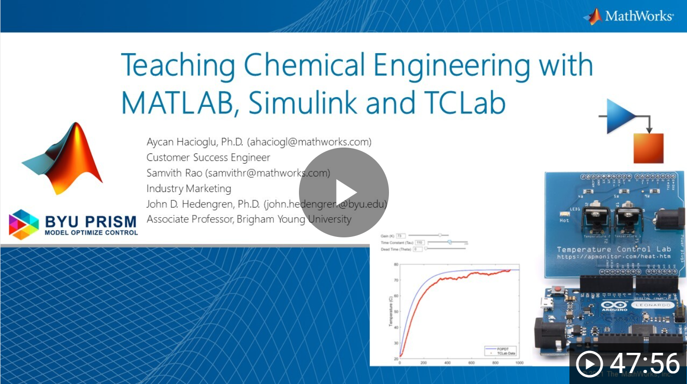

# Process Dynamics and Control in MATLAB
This course focuses on a complete start to finish process of physics-based modeling, data driven methods, and controller design. Although some knowledge of computer programming is required, students are led through several introductory topics that develop an understanding of numerical methods in process control. Students should start with the [Begin MATLAB Short Course](https://github.com/APMonitor/begin_matlab) that takes 2-3 hours to complete.

 [View MathWorks Webinar](https://youtu.be/SAjFN8mnFCU)

This course focuses on methods that are used in practice for simple or complex systems. It is divided into three main parts including (1) data driven modeling and controller development, (2) physics-based modeling and controller development, and (3) advanced controls with optimization. Example problems are provided throughout in the MATLAB programming language.
## Professor

[John Hedengren](https://www.linkedin.com/in/hedengren/) leads the [BYU PRISM](https://apm.byu.edu/) group with interests in combining data science, optimization, and automation with current projects in hybrid nuclear energy system design and unmanned aerial vehicle photogrammetry. He earned a doctoral degree at the University of Texas at Austin and worked 5 years with ExxonMobil Chemical prior to joining BYU in 2011.
## Teaching Assistant

[Joshua Hammond](https://www.linkedin.com/in/j-edward-hammond) is an experienced researcher in Process Systems Engineering leveraging Data Science, Machine Learning, Optimization, and domain knowledge to achieve optimal solutions. Joshua developed the MATLAB dynamics and control course from the [Python version](https://apmonitor.com/pdc) with technical support from [Colin Anderson](https://www.linkedin.com/in/colin-r-anderson/) and [Nathanael Nelson](https://www.linkedin.com/in/nathanael-martin-nelson-eit-a3183598/). Assignment solution videos are published to the [Horizon PSE](https://www.youtube.com/channel/UCGsMPf9oCqIeuOtZEKAxaqg) YouTube Channel.
## Course Objectives
It is the intent of this course to help the student to:
1. Understand and be able to describe quantitatively the dynamic behavior of process systems.
2. Learn the fundamental principles of classical control theory, including different types of controllers and control strategies.
3. Develop the ability to describe quantitatively the behavior of simple control systems and to design control systems.
4. Develop the ability to use computer software to help describe and design control systems.
5. Learn how to tune a control loop and to apply this knowledge in the laboratory.
6. Gain a brief exposure to advanced control strategies.

## Course Schedule

| Class                                                 | Topic                                                                          | Assignment                                  | TCLab Activity                               |
|-------------------------------------------------------|--------------------------------------------------------------------------------|---------------------------------------------|----------------------------------------------|
| [L01](https://github.com/APMonitor/mdc/tree/main/L01) | Course Introduction                                                            | Begin MATLAB                                | Begin MATLAB (Continued)                     |
| [L02](https://github.com/APMonitor/mdc/tree/main/L02) | Simulate Dynamics in MATLAB                                                    | Simulate HIV Infection                      | Step Test Simulation                         |
| [L03](https://github.com/APMonitor/mdc/tree/main/L03) | Physics-based Dynamic Modeling                                                 | Derive Balance Equations                    | Convective Heat Transfer                     |
| [L04](https://github.com/APMonitor/mdc/tree/main/L04) | Transient Balance Equations                                                    | Tank Blending Simulation                    | Radiative Heat Transfer                      |
| [L05](https://github.com/APMonitor/mdc/tree/main/L05) | Linearize Balance Equations                                                    | Linearize Differential Equations            | Linearize Energy Balance                     |
| [L06](https://github.com/APMonitor/mdc/tree/main/L06) | First-Order Linear Dynamics with Dead Time using Graphical Fitting Methods     | Graphical FOPDT Fit                         | TCLab Graphical FOPDT Fit                    |
| [L07](https://github.com/APMonitor/mdc/tree/main/L07) | Optimize Model Parameter Fit                                                   | Parameter Regression                        | Regression FOPDT                             |
| L08                                                   | Exam Review on Modeling and Dynamics                                           | Practice Exam                               |                                              |
| L09                                                   | Exam on Dynamic Modeling                                                       |                                             |                                              |
|                                                       |                                                                                |                                             |                                              |
| Class                                                 | Topic                                                                          | Assignment                                  | TCLab Activity                               |
| [L10](https://github.com/APMonitor/mdc/tree/main/L10) | Control Design                                                                 | Controller Design Exercise                  | TCLab Controller Design                      |
| [L11](https://github.com/APMonitor/mdc/tree/main/L11) | Proportional-only (P-only) Control                                             | Tank Level                                  | P-only Control                               |
| [L12](https://github.com/APMonitor/mdc/tree/main/L12) | Proportional Integral (PI) Control                                             | Auto Cruise Control                         | PI Control                                   |
| [L13](https://github.com/APMonitor/mdc/tree/main/L13) | Proportional Integral Derivative (PID) Control                                 | Blending Control                            | PID Control                                  |
| [L14](https://github.com/APMonitor/mdc/tree/main/L14) | Case Study: Level Control                                                      | Level Control                               | PI Control Tuning                            |
| [L15](https://github.com/APMonitor/mdc/tree/main/L15) | Case Study: Nonlinear System Control                                           | Exothermic Reactor                          | PID Control Tuning                           |
| [L16](https://github.com/APMonitor/mdc/tree/main/L16) | Case Study: Disturbances                                                       | Type-I Diabetic Blood Glucose               | PID with Feedforward                         |
| [L17](https://github.com/APMonitor/mdc/tree/main/L17) | Valve Design Principles                                                        | Valve Design Exercise                       | Heater Actuator                              |
| [L18](https://github.com/APMonitor/mdc/tree/main/L18) | Sensors and Data Acquisition                                                   | Sensor Design Exercise                      | Temperature Sensor                           |
| L19                                                   | Exam Review on Sensors, Actuators, and Controllers                             | Practice Exam                               |                                              |
| L20                                                   | Exam on Sensors, Actuators, and Controllers                                    |                                             |                                              |
|                                                       |                                                                                |                                             |                                              |
| Class                                                 | Topic                                                                          | Assignment                                  | TCLab Activity                               |
| [L21](https://github.com/APMonitor/mdc/tree/main/L21) | Single Heater Modeling | [TCLab Project Overview](https://github.com/APMonitor/mdc/tree/main/L21/Arduino_lab_rubric.pdf)     | Dual Heater Modeling 2                       |
| [L22](https://github.com/APMonitor/mdc/tree/main/L22) | Single Heater Regression                                                       |                                             | Dual Heater Regression 2                     |
| [L23](https://github.com/APMonitor/mdc/tree/main/L23) | Single Heater Control                                                          | 2 Page Report                               | Dual Heater Control 2                        |
|                                                       |                                                                                |                                             |                                              |
| [L24](https://github.com/APMonitor/mdc/tree/main/L24) | Laplace Transforms                                                             | Laplace Transform Applications              | Impulse Response                             |
| [L25](https://github.com/APMonitor/mdc/tree/main/L25) | Transfer Functions                                                             | Block Diagrams with Transfer Functions      | Block Diagram                                |
| [L26](https://github.com/APMonitor/mdc/tree/main/L26) | State Space Models                                                             | Reactor State Space                         | State Space Simulation                       |
| [L27](https://github.com/APMonitor/mdc/tree/main/L27) | Second Order Systems with Graphical Fitting                                    | Second Order Estimation: Graphical          | On/Off Control                               |
| [L28](https://github.com/APMonitor/mdc/tree/main/L28) | Second Order Optimization                                                      | Second Order Estimation: Optimization       | Second Order Regression                      |
| [L29](https://github.com/APMonitor/mdc/tree/main/L29) | Simulation of FOPDT, SOPDT, and Higher Order Systems                           | Distillation Control                        | Higher Order Regression                      |
| [L30](https://github.com/APMonitor/mdc/tree/main/L30) | Stability Analysis                                                             | Controller Stability Limits                 | P-Only Stability Analysis                    |
| [L31](https://github.com/APMonitor/mdc/tree/main/L31) | Cascade Control and Feedforward Control                                        | Cascade or Feedforward Control Design       | Cascade Control                              |
| L32                                                   | Exam Review on Dynamic Systems Analysis                                        | Practice Exam                               |                                              |
| L33                                                   | Exam on Dynamic Systems Analysis                                               |                                             |                                              |
|                                                       |                                                                                |                                             |                                              |
| Class                                                 | Topic                                                                          | Assignment                                  | TCLab Activity                               |
| [L34](https://github.com/APMonitor/mdc/tree/main/L34) | Control Project Introduction                                                   | Control Project                             |                                              |
| [L35](https://github.com/APMonitor/mdc/tree/main/L35) | Optimization Introduction                                                      | Control Project                             |                                              |
| [L36](https://github.com/APMonitor/mdc/tree/main/L36) | Linear Programming                                                             | Control Project                             |                                              |
| [L37](https://github.com/APMonitor/mdc/tree/main/L37) | Scheduling Optimization                                                        | Control Project                             |                                              |
| [L38](https://github.com/APMonitor/mdc/tree/main/L38) | Nonlinear Programming                                                          | Control Project                             |                                              |
| [L39](https://github.com/APMonitor/mdc/tree/main/L39) | Machine Learning Classification                                                | Control Project                             |                                              |
| [L40](https://github.com/APMonitor/mdc/tree/main/L40) | Model Predictive Control                                                       | Control Project                             |                                              |
| L41                                                   | Project Help Session                                                           | Control Project                             |                                              |
| L42                                                   | Final Exam Review                                                              | Practice Exam                               |                                              |
| Final                                                 | Project Report (2 pages) and Presentation (5 min) Final Exam                   |                                             |                                              |

 [MATLAB](https://github.com/APMonitor/mdc) and [Python](https://github.com/APMonitor/pdc) Repository on Github

 [Course Web-site](https://apmonitor.com/pdc) and [Schedule](https://apmonitor.com/pdc/index.php/Main/CourseSchedule)

 View the [Repository on MATLAB Drive](https://drive.matlab.com/sharing/ac9d959a-e586-4478-ad56-5078ed578753)

 [Temperature Control Lab](https://apmonitor.com/heat.htm)

 [View MathWorks Webinar](https://youtu.be/SAjFN8mnFCU)

The materials in this archive are released under the [MIT License](./LICENSE). The financial assistance of MathWorks is gratefully acknowledged with technical assistance of [Melda Ulusoy](https://www.linkedin.com/in/melda-ulusoy-323bb670/) and others at MathWorks.
